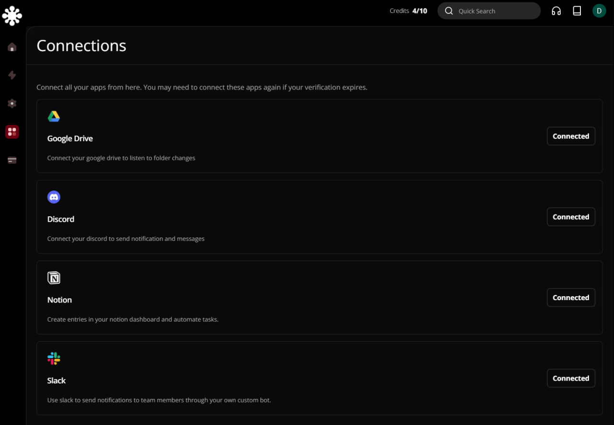
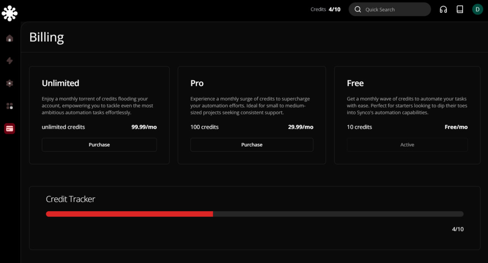
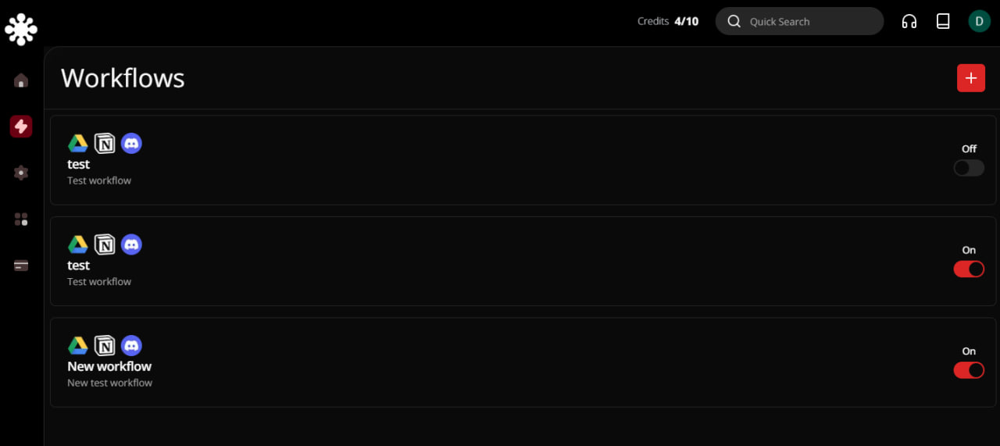

#  Synco, a SaaS automation platform

Synco is an automation platform thought as a Software as a Service. Similar to other apps on the internet such as IFTT and Zappier.

Synco allows you to automate Google Drive folders, Notion entries and Discord and Slack messages in a simple and stilish way.
## Functionalities
- 📄Functioning landing page
- 👨Clerk authentication
- ⭐Tailwind
- ⚡️Aceternity UI & Shadcn UI
- 🗄️Prisma ORM
- 🏢 Google API for login  
- 🌐 Watch for changes in Google Drive 
- 🚀 Slack API integration
- 💻 Discord API integration 
- 🔄 Notion API integration 
- 💰 Stripe Subscription plans
- 🔐 Payments based on credits consumed 
- 🚨 Drag and drop node builder 
- 🧩 Create automations flows 
- 📊 Create a sequence of actions to fire after a trigger event happens 
- 🗺️ Mini map to see all workflow nodes 
- ⭐️ Infinite Canvas 
- 🌙 Light & Dark mode
  
##  Preview  

   

